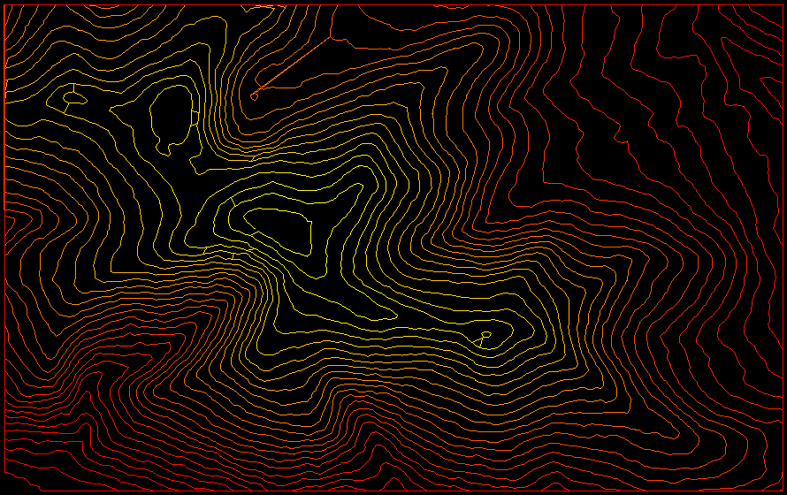

# SandTableGeography
A way to convert topographic maps into gcode for a kinetic sand table. This take in the input data as `.tif` or `.hgt` files and creates a single continuous path in gcode that traces to topography lines. The given geographic bounding box can be rotated in increments of 90 degrees and will be cropped to fit the exact dimentions of the specified table.

### Visual

*North is to the left*

# Requirements

Tested with python version `3.9.0`

### Install dependencies
```
pip install -r ./requirements.txt
```

# Inputs

### Positionals

| Argument | Type | Example |
| :---------------- | :------ | ----: |
| Latitude 1 | Float | 44.04207 |
| Longitude 1 | Float | -71.85694 |
| Latitude 2 | Float | 43.99183 |
| Longitude 2 | Float | -71.80904 |
| Table Dimention |  Dimention WIDTHxHEIGHT in millimeters | 880x550 |


### Optionals
| Short | Long | Type | Default | Description |
| :---------------- | :------ | ---- | -- | --- |
| -t | --topography | file or directory path | `./input_data/` | The elevation data to read in |
| -o | --output | file path | `output.gcode` | The output gcode file. The image representation will use the same name, with a `.png` extension |
| -r | --rotation | integer (0,90,180,270) | `0` | The rotation in degrees the path should be made in |
| -n | --num-contours | integer | `20` | The number of elevation contours to draw betwween the minimum and maximum poinst of elevation of the area mapped |
| -d | --debug-dir | directory path | *None* | A directory to output debugging related files. This includes a drawing of each elevation, before and after loops have been merged. This may generate a lot of image files and is off by default |


# Example: Mt. Moosilauke
```
python3 ./main.py 44.04207 -71.85694 43.99183 -71.80904 880x550 -r 90
```

### Expected Output
- `./output.gcode` The gcode output for the table
- `./output.png` An image showing the path the gcode will take on the table

### Output image

*North is to the left*

# Testing

### Run unit tests
```
python3 -m pytest
```
